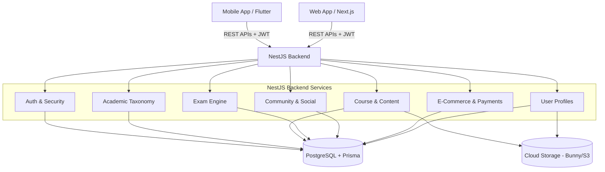

# 01. Project Overview

## What is Masarak?
Masarak is a comprehensive, scalable e-learning platform specifically tailored to the Egyptian educational ecosystem. It connects students with high-quality educational content, teachers, and an interactive learning community. It supports structured academic paths ranging from primary schools to specialized tracks (e.g., Science, Math, Arts) and beyond.

## Main Purpose
The platform's primary goal is to digitize the learning experience by providing video courses, interactive question banks, assignments, live sessions, and community forums. It serves as a fully integrated Learning Management System (LMS) combined with e-commerce features (payments, coupons, subscriptions) to allow instructors to monetize their content and students to track their academic progress seamlessly.

## Main User Journey
1. **Onboarding & Auth**: A user registers as either a `STUDENT` or a `TEACHER` using phone numbers or email, verified via OTP.
2. **Exploration**: Students browse the catalog (Courses, Learning Paths) filtered by their Academic Year, Track, and Subject.
3. **Enrollment**: Students purchase courses using the internal Cart & Checkout system (Payments integrations).
4. **Learning**: Students consume content (Videos, PDFs) and track their progress through the Course Player.
5. **Assessment**: Students take customized Exams generated from a dynamic Question Bank, submit Assignments, and receive scores.
6. **Community**: Users interact in a social feed (Community posts, Comments, Reactions) to ask questions and share knowledge.
7. **Dashboard**: Teachers use their dashboard to create courses, manage students, view analytics, and grade assignments. Admins oversee the entire platform taxonomy, users, and financials.

## Core Features
- **Hierarchical Taxonomy**: Stage -> Level -> Department -> Branch (e.g., Secondary -> Grade 12 -> Science -> Biology).
- **Advanced Exam Engine**: Question Banks with categories, randomization, multiple question types (MCQ, True/False, Essay), and auto-grading.
- **Role-based Access Control (RBAC)**: Distinct permissions for STUDENT, TEACHER, ADMIN, SUPER_ADMIN, CONTENT_MANAGER, ASSISTANT_TEACHER, PARENT.
- **E-Commerce Module**: Cart, Orders, Coupons, Wallets, and Teacher Revenue Analytics.
- **Interactive Community**: Social-media-like feeds for platform-wide or course-specific discussions.
- **AI Support Assistant**: RAG-based AI assistant for platform queries and conversational help.
- **Notification System**: Push, SMS, and Email alerts for assignments, payments, and system updates.

## Existing Architecture
Masarak is built using a modern, decoupled architecture:
- **Frontend (Web)**: Built with Next.js 14+ (App Router), React, TailwindCSS, and Zustand for state management. It acts as the primary client.
- **Backend**: Built with NestJS (TypeScript), utilizing a modular Domain-Driven Design (DDD) approach.
- **Database**: PostgreSQL managed via Prisma ORM.
- **Authentication**: Custom JWT-based authentication with refresh tokens (handled in NestJS, no third-party auth providers like Firebase/Supabase are used for core auth).
- **Storage/Media**: Media assets (videos, PDFs, images) are handled via cloud providers (Cloudinary/S3/BunnyCDN), though the schema supports local and Firebase fallback.

## High-Level System Overview Diagram

