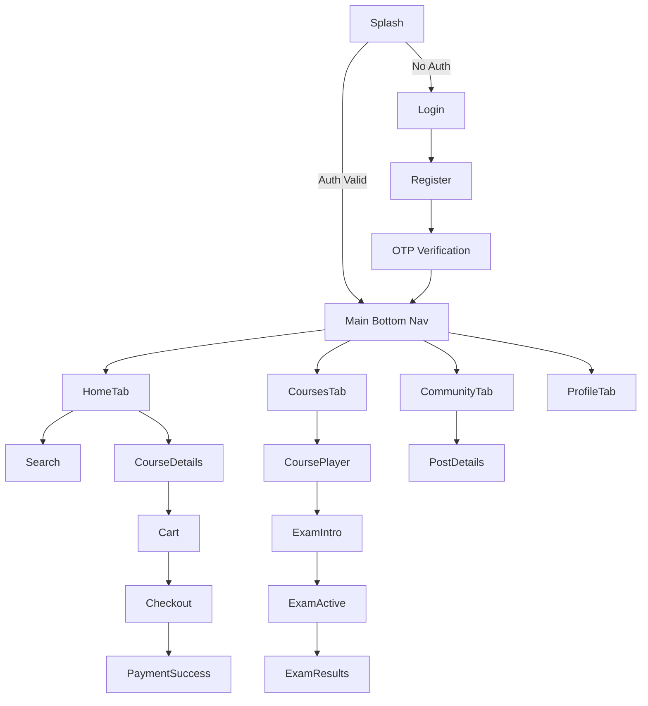

# 04. Navigation Map

This document outlines the entire navigation map of the mobile application, deep linking opportunities, and transition behaviors.

## 1. Application Navigation Hierarchy

We recommend using a structured router like `go_router` or `auto_route` in Flutter to mirror this hierarchy.

### App Root
- `/splash`
- `/onboarding`
- `/login`
- `/register`
- `/verify-otp`

### Main Authenticated Shell (Bottom Navigation)
**Note:** The Bottom Navigation Bar changes based on Role (Student vs. Teacher).

#### Student Shell
1. **Home Tab**: `/student/home`
2. **My Courses Tab**: `/student/courses`
3. **Community Tab**: `/community/feed`
4. **Profile Tab**: `/student/profile`

#### Teacher Shell
1. **Home Tab**: `/teacher/home`
2. **Management Tab**: `/teacher/courses`
3. **Community Tab**: `/community/feed`
4. **Profile Tab**: `/teacher/profile`

### Nested Routes (Pushed on top of Bottom Navigation)
These routes should NOT show the bottom navigation bar (Hide bottom bar on push).

**From Discovery/Home:**
- `/search`
- `/categories/:stageId`
- `/categories/:stageId/:levelId`
- `/course/:id` (Public Details)
- `/teacher/:id` (Public Profile)

**From My Courses:**
- `/player/:courseId`
  - `/player/:courseId/viewer/:attachmentId` (PDF Viewer)
  - `/player/:courseId/exam/:examId/intro`
  - `/player/:courseId/exam/:examId/active`
  - `/player/:courseId/exam/:examId/results`

**From Community:**
- `/community/post/:id`
- `/community/create`

**From Cart/Checkout:**
- `/cart`
- `/checkout`
- `/payment/success`
- `/payment/failed`

---

## 2. Modal & Dialog Navigation

Some flows require full-screen modals, bottom sheets, or simple dialogs to avoid disrupting the main context.

### Bottom Sheets
- **Comments Bottom Sheet**: Triggered from Community Feed or Course Player.
- **Select Payment Method**: Triggered inside Checkout.
- **Course Outline (Syllabus)**: Triggered inside the Course Player.
- **Image Picker**: Triggered when editing Avatar.

### Dialogs (Alerts)
- **Logout Confirmation**: "Are you sure you want to log out?"
- **Submit Exam Confirmation**: "You have 5 unanswered questions. Submit?"
- **Lock Account Warning**: "Too many failed attempts."

---

## 3. Back Behavior & Routing Rules

1. **Android Hardware Back Button**: Must always mirror the top-left App Bar back button.
2. **Exam Active Screen**:
   - Tapping "Back" must trigger a `WillPopScope` or `PopScope` dialog: "If you leave, your exam will be submitted automatically."
3. **Auth Flow**:
   - After a successful login, the app must `goRouter.go('/home')` (clearing the auth stack) to prevent the user from pressing "Back" to return to Login.
4. **Payment Flow**:
   - After payment success, navigating back should return the user to the Course Details or Home, NOT the Checkout Webview.

---

## 4. Deep Linking & App Links

Deep linking should be configured natively in Android (`AndroidManifest.xml`) and iOS (`Runner.entitlements`) to intercept the `masarak.com` domain.

### Supported Deep Links:
1. `https://masarak.com/course/:id` -> Navigates to Public Course Details.
2. `https://masarak.com/teacher/:id` -> Navigates to Teacher Profile.
3. `https://masarak.com/community/post/:id` -> Opens the specific community post.
4. `https://masarak.com/verify-reset-code?code=1234` -> Opens Password Reset screen with pre-filled code.

### Deep Link State Restoration
If the user clicks a deep link but is NOT logged in:
1. Save the intended deep link path in memory.
2. Route to `/login`.
3. After successful login, route to the saved deep link path.

---

## 5. Visual Flow Diagram (Mermaid)

