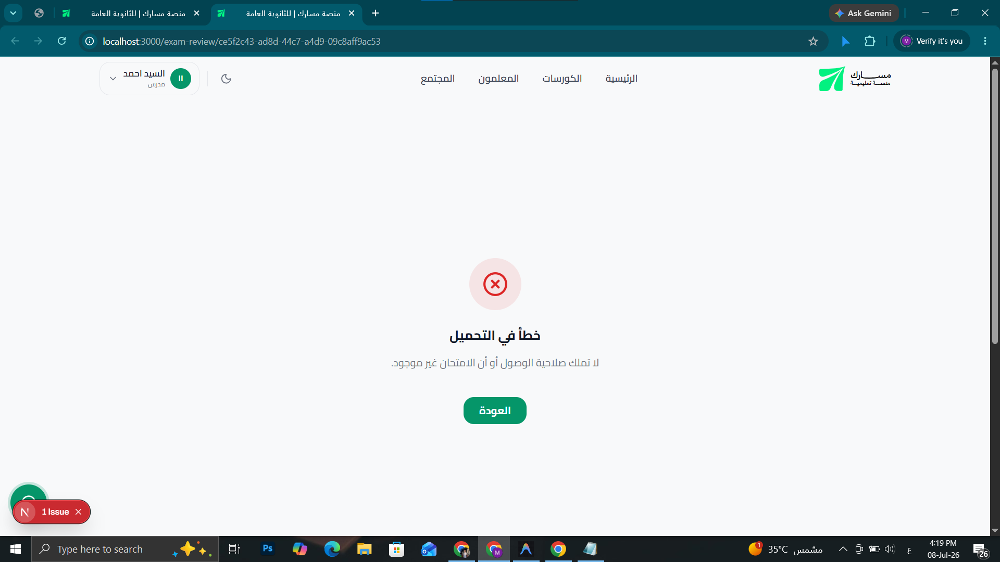
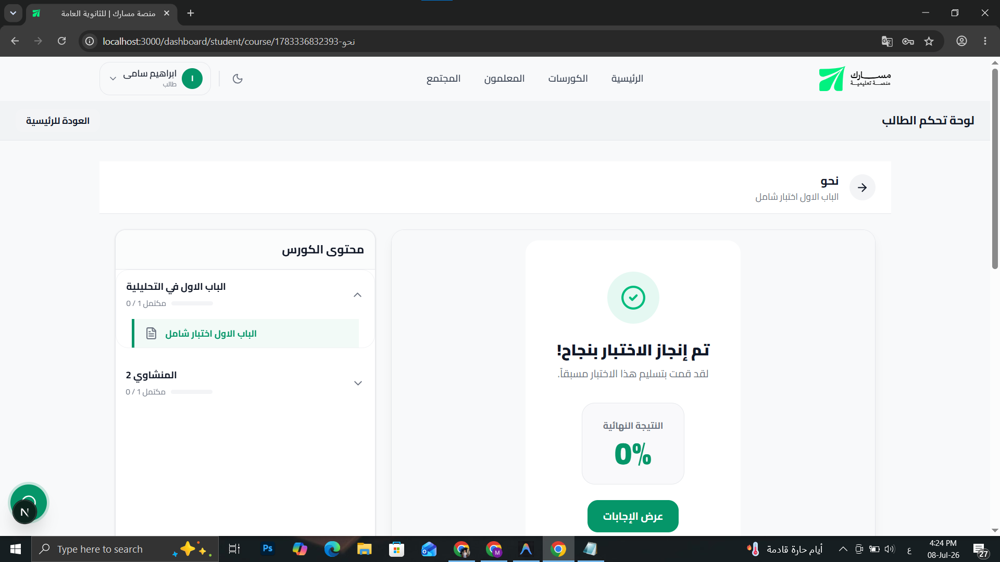
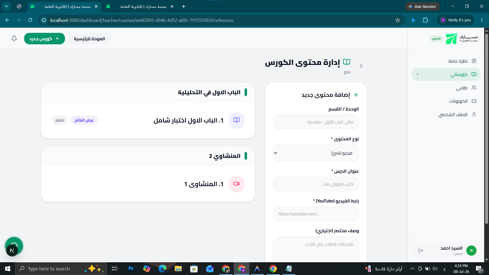
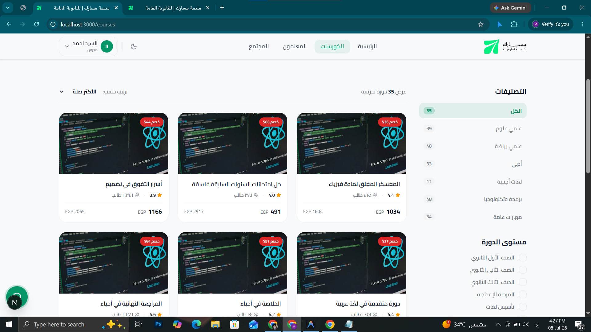
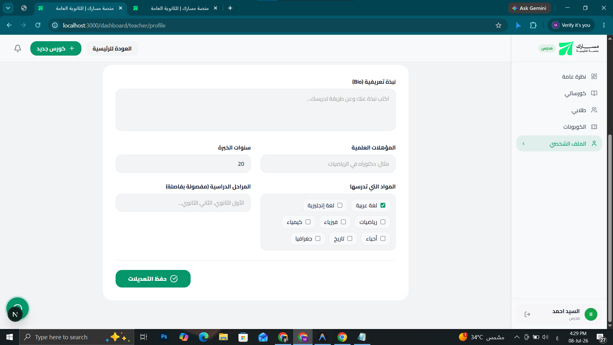
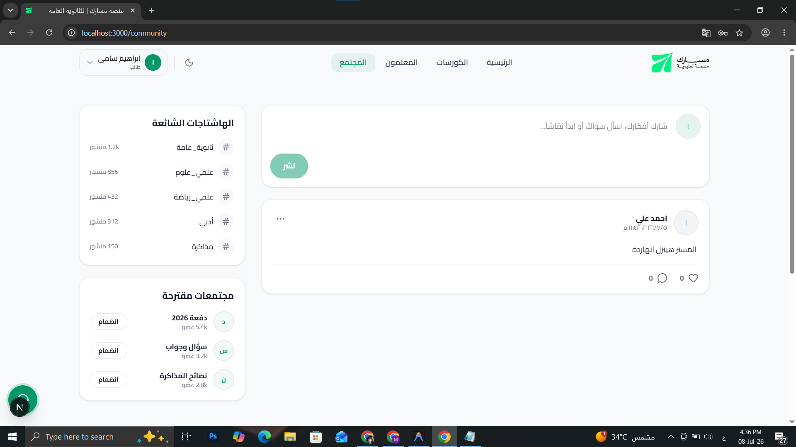
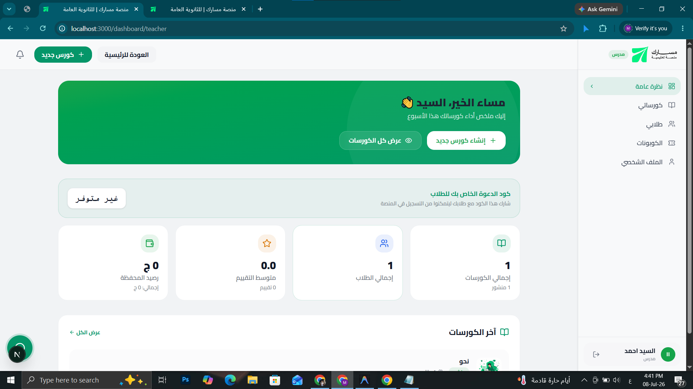
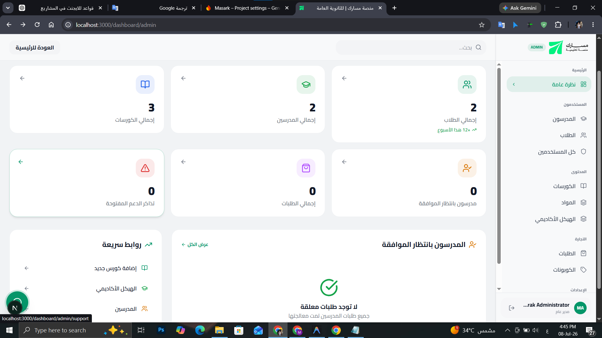

Invalid `this.prisma.user.findUnique()` invocation in
E:\Masarak\backend\src\modules\exam\services\exam.service.ts:305:41

  302 const isStudent = session.studentId === userId;
  303 let isTeacherOrAdmin = false;
  304 
→ 305 const user = await this.prisma.user.findUnique({
        where: {
          id: undefined,
      ?   email?: String,
      ?   phone?: String,
      ?   username?: String,
      ?   AND?: UserWhereInput | UserWhereInput[],
      ?   OR?: UserWhereInput[],
      ?   NOT?: UserWhereInput | UserWhereInput[],
      ?   password?: StringFilter | String,
      ?   firstName?: StringFilter | String,
      ?   middleName?: StringFilter | String,
      ?   lastName?: StringFilter | String,
      ?   familyName?: StringFilter | String,
      ?   name?: StringNullableFilter | String | Null,
      ?   role?: EnumRoleFilter | Role,
      ?   avatar?: StringNullableFilter | String | Null,
      ?   bio?: StringNullableFilter | String | Null,
      ?   dateOfBirth?: DateTimeNullableFilter | DateTime | Null,
      ?   gender?: EnumGenderNullableFilter | Gender | Null,
      ?   isActive?: BoolFilter | Boolean,
      ?   emailVerified?: BoolFilter | Boolean,
      ?   phoneVerified?: BoolFilter | Boolean,
      ?   requiresPasswordChange?: BoolFilter | Boolean,
      ?   failedLoginAttempts?: IntFilter | Int,
      ?   lockedUntil?: DateTimeNullableFilter | DateTime | Null,
      ?   twoFactorEnabled?: BoolFilter | Boolean,
      ?   twoFactorSecret?: StringNullableFilter | String | Null,
      ?   createdAt?: DateTimeFilter | DateTime,
      ?   updatedAt?: DateTimeFilter | DateTime,
      ?   studentProfile?: StudentProfileNullableScalarRelationFilter | StudentProfileWhereInput | Null,
      ?   teacherProfile?: TeacherProfileNullableScalarRelationFilter | TeacherProfileWhereInput | Null,
      ?   adminProfile?: AdminProfileNullableScalarRelationFilter | AdminProfileWhereInput | Null,
      ?   settings?: UserSettingsNullableScalarRelationFilter | UserSettingsWhereInput | Null,
      ?   notificationSettings?: NotificationSettingsNullableScalarRelationFilter | NotificationSettingsWhereInput | Null,
      ?   privacySettings?: PrivacySettingsNullableScalarRelationFilter | PrivacySettingsWhereInput | Null,
      ?   preferences?: UserPreferencesNullableScalarRelationFilter | UserPreferencesWhereInput | Null,
      ?   profileImages?: ProfileImageListRelationFilter,
      ?   devices?: DeviceListRelationFilter,
      ?   activityLogs?: ActivityLogListRelationFilter,
      ?   payments?: PaymentListRelationFilter,
      ?   comments?: CommentListRelationFilter,
      ?   notifications?: NotificationListRelationFilter,
      ?   submissions?: SubmissionListRelationFilter,
      ?   sessions?: SessionListRelationFilter,
      ?   otps?: OtpListRelationFilter,
      ?   auditLogs?: AuditLogListRelationFilter,
      ?   courseProgress?: CourseProgressListRelationFilter,
      ?   lessonProgress?: LessonProgressListRelationFilter,
      ?   videoProgress?: VideoProgressListRelationFilter,
      ?   watchHistory?: WatchHistoryListRelationFilter,
      ?   notes?: StudentNoteListRelationFilter,
      ?   bookmarks?: LessonBookmarkListRelationFilter,
      ?   certificates?: CourseCertificateListRelationFilter,
      ?   favorites?: FavoriteCourseListRelationFilter,
      ?   recentlyViewed?: RecentlyViewedListRelationFilter,
      ?   reminders?: StudentReminderListRelationFilter,
      ?   goals?: StudentGoalListRelationFilter,
      ?   streak?: StudentStreakNullableScalarRelationFilter | StudentStreakWhereInput | Null,
      ?   achievements?: StudentAchievementListRelationFilter,
      ?   statistics?: StudentStatisticsNullableScalarRelationFilter | StudentStatisticsWhereInput | Null,
      ?   learningSessions?: LearningSessionListRelationFilter,
      ?   downloads?: DownloadHistoryListRelationFilter,
      ?   bookmarkCollections?: BookmarkCollectionListRelationFilter,
      ?   enrollments?: EnrollmentListRelationFilter,
      ?   cart?: CartNullableScalarRelationFilter | CartWhereInput | Null,
      ?   orders?: OrderListRelationFilter,
      ?   couponUsages?: CouponUsageListRelationFilter,
      ?   invitationsSent?: CourseInvitationListRelationFilter,
      ?   supportTickets?: SupportTicketListRelationFilter,
      ?   communityPosts?: CommunityPostListRelationFilter,
      ?   communityComments?: CommunityCommentListRelationFilter,
      ?   communityReactions?: CommunityReactionListRelationFilter,
      ?   uploadedMedia?: MediaAssetListRelationFilter,
      ?   requestedReports?: ExportReportListRelationFilter,
      ?   examSessions?: ExamSessionListRelationFilter,
      ?   grantedRetakes?: ExamRetakePermissionListRelationFilter,
      ?   receivedRetakes?: ExamRetakePermissionListRelationFilter
        }
      })

Argument `where` of type UserWhereUniqueInput needs at least one of `id`, `email`, `phone` or `username` arguments. Available options are marked with ?.
Show More
src/shared/api/api.client.ts (92:13) @ <unknown>

  90 |       }
  91 |       
> 92 |       throw new ApiError(message, status, data);
     |             ^
  93 |     } else if (error.request) {
  94 |       throw new ApiError('لا يمكن الاتصال بالخادم. يرجى التحقق من اتصالك بالإنترنت.', 503);
  95 |     } else {
Call Stack
3

Show 1 ignore-listed frame(s)
<unknown>
file:///E:/Masarak/backend/src/modules/exam/services/exam.service.ts (305:41)
<unknown>
------------------------
المشكلة حصلت لما عملت عرض لا الاجابات لطالب اختبر الامتحان فعلا 
وزر السماح باعادة الامتحان مش شغال ولا يظهر اي رد فعل المفروض كمان يبعت اشعار للطالب انه يعيد الامتحان عادي 
--------------------------

الطالب بظهله قسم جوا القسم سكاشن 

المعلم مش عنده صلاحية انه يضيف سكشن ليه لازم يكون عنده صلاحية اضافة سيكشن ويختار هو فيديو او ملف او اختبار  لازم يبقا في تكامل 
-----------------------------------

نظام التصنيفات فيه كورسات للاختبار لااحتاجها احتاج انه يكون فعلا المعلومات الحقيقية والكورسات التي تم اضافتها فعلا و تصنيفاتهاتكون بناءا على نظام ذكي يمز كل حاجة معني مساعدك وعامل تصنيف لكل مدرس انه بيدي مادة عينة يعني كل الكورسات اللي هينزلها هتكون خاصة بالمادة دي وكمان اضافة 
------------------------------------

ازالة قسم المواد التي تدرسها من حساب المعلم ملهاش لازمة 
-----------------------------
الطلب طبعا وهو بيسجل الدخول بيحدد هو في اي صف فهنعمل نظام متكامل 
الطالب لايظهر له الا الكورسات المخصصة للصف بتاعه فقط ولا يظهر له اي كورسات اخرى في الرئسية او الكورسات او من خلال الدخول على المعلمون واختيار كورس اخر 
----------------------------
كذالك المعلم بحدد في معلومات و التفاصيل بتاع الكورس انه مخصص لاي صف وبناءا عليه هيساعدكك في التصنيف وهيساعد ان دا بس المخصص للطلاب اللي ف الصفوف المعينة وهيخدم على القطة السابق 
-----------------------------------
يوجد مشكلة ال
عند حديث الصفحة عدد مرات معين او فترة معينة قدتها بيحصل انه بيطلب تسجيل الدخول مرة اخرى  ومبيحفظش وتذكرني مش بيحافظ على ان تسجيل الدخول يفضل علطول ططالما داخل من نفس المتصفح والجهاز 
--------------------------

بالنسبة للكوميونتي النظام غير متكامل التعليقات و التفاعل و مين اللي يظهرله تلت نقط ومين لا يعني الطالب ظهرله ثلاث نقط يكون فيها خيارات مساعدة على الرسائل وتؤدي وظيفتها فعلا كذال المدرس و التفاعل و التعليق و الادمن ايضا وظهر شارات تميز ان اللي نزل البوست طالب او معلم او ادمن 
يالنسبة للهشتاجات هي يتتعرض بس لما بدوي عليها مش بتضاف ولا هي مثلا تصنيف وا اي وظفتها مش عارف لازم تعملها وظائف و المجتمعات المقترحة هو مجتمع واحد مفيش اصلا مجتمعات تانية ياعني شيلها كلها بالقسم بتعها 
 -------------------------------------------
 
 ازالة كود الدعوة الخاص بك للطلاب احنا شيلناها اصلا فشيلها خالص تمام من كل الحسابات 
 ---------------------------
 
 بالنسبة للادمن في ف الداش بورد حاجة اسمها تذاكر الدعم المفتوحة ملهاش لازمة شيلها وحط حاجة مفيدة مكنها او حاجة مهمة 
 ------------------------------
 تاكد عند حذف الادمن حسابات انها بيتم حذفها من الداتا بيز دا مش تعديل دا تشيك 